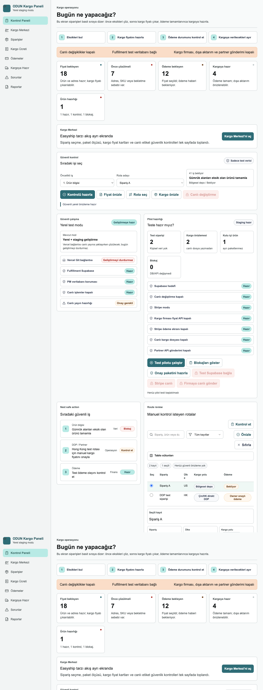
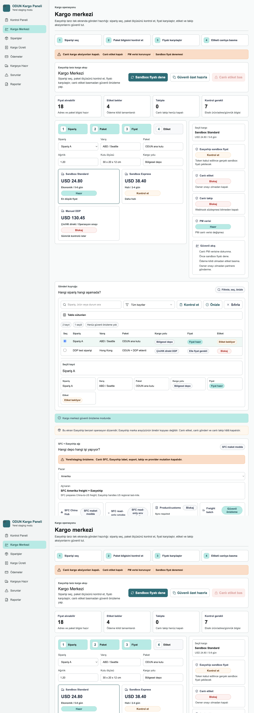
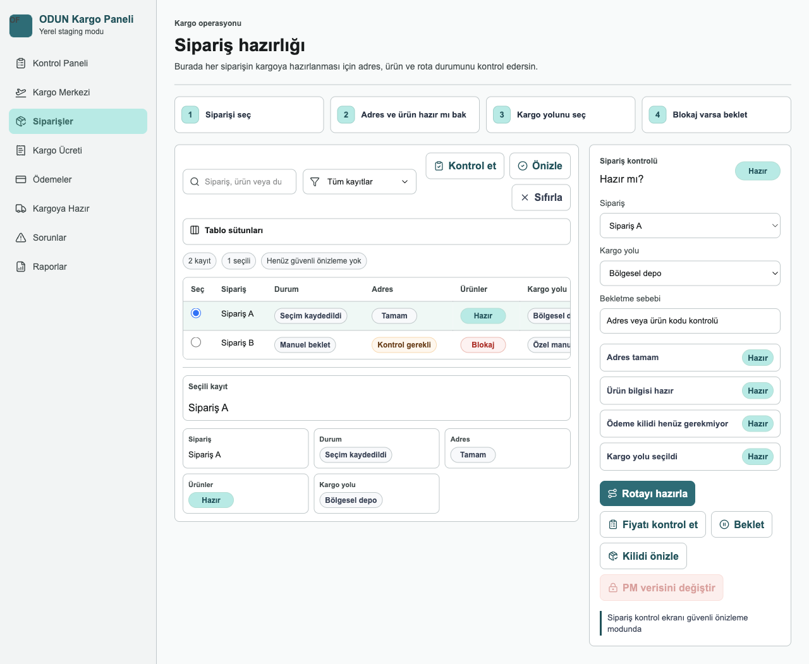
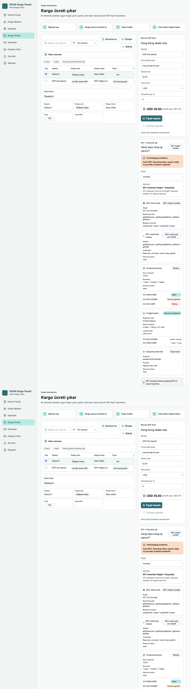
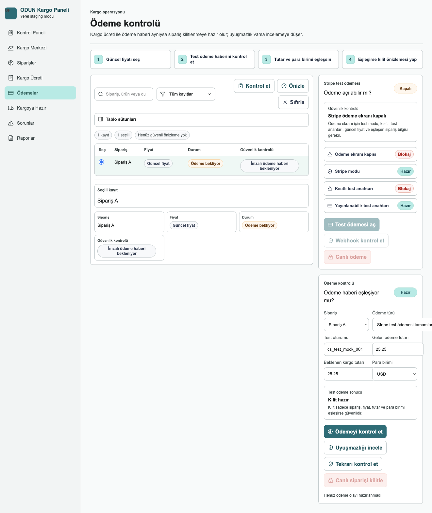
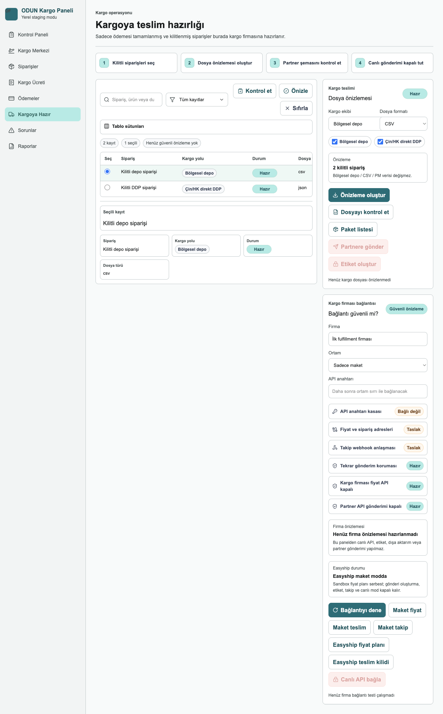
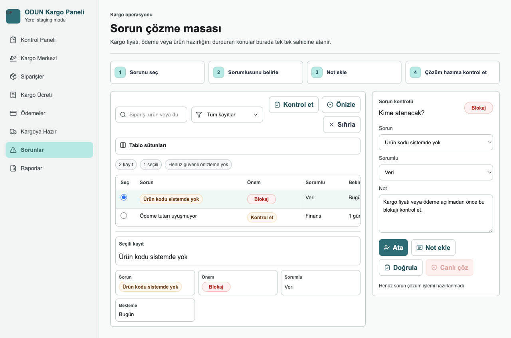
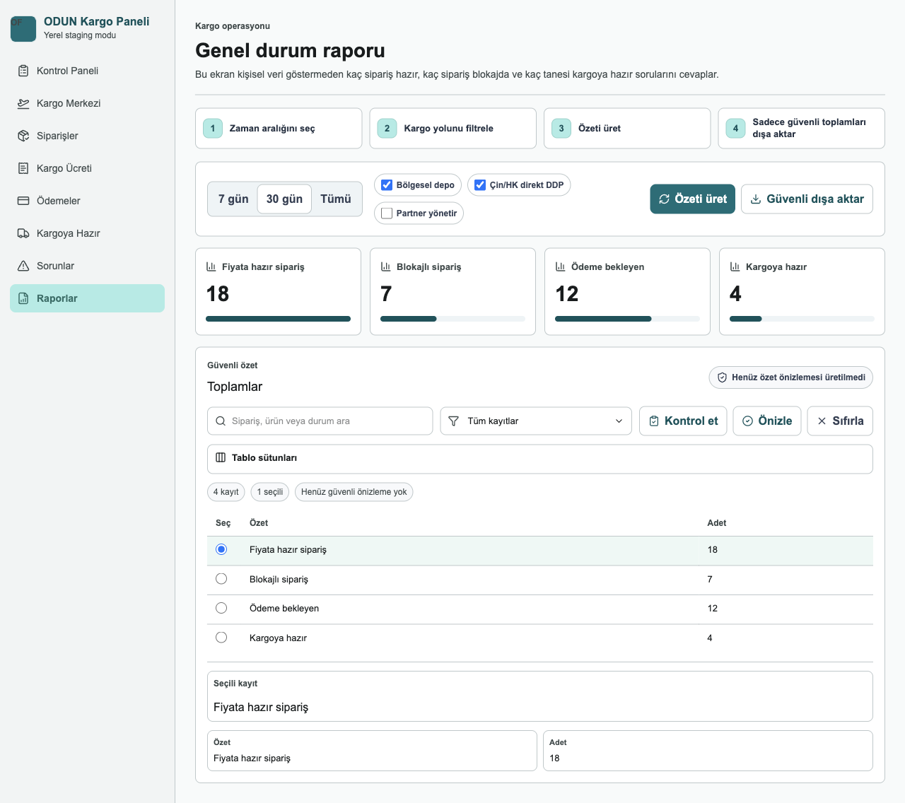

# ODUN Fulfillment Kullanım Kılavuzu

Bu kılavuz ODUN Fulfillment panelini kullanan founder/admin operatörü için hazırlanmıştır. Ekran görüntüleri yerel/staging önizleme ortamından alınmıştır ve sentetik test verisi gösterir.

Önemli güvenlik kuralı: Bu uygulamada canlı PM verisine dokunma, canlı etiket basma, canlı kargo oluşturma, canlı provider çağrısı, dışa aktarım ve takip aksiyonları owner onayı olmadan kapalıdır.

## 1. Genel Gezinme

Uygulamanın sol menüsü ana iş akışını gösterir:

- Kontrol Paneli: Bugünkü genel durum ve sıradaki güvenli aksiyonlar.
- Kargo Merkezi: Sipariş seçme, paket kontrolü, fiyat karşılaştırma ve etiket önizleme alanı.
- Siparişler: Sipariş readiness tablosu.
- Kargo Ücreti: Kargo rotası, fiyat ve manual DDP hazırlığı.
- Ödemeler: Ödeme event kontrolü ve Stripe test hazırlığı.
- Kargoya Hazır: Handoff/export önizleme alanı.
- Sorunlar: Blokaj ve exception triage.
- Raporlar: Operasyon özetleri.

## 2. Kontrol Paneli

Kontrol Paneli uygulamanın başlangıç ekranıdır. Burada amaç, operatörün ilk 5 saniyede neye bakacağını anlamasıdır.

Adımlar:

1. Üstteki güvenlik şeridini kontrol edin. Canlı aksiyonların kapalı olduğunu doğrulayın.
2. Özet kartlarından hazır, bloklu, ödeme bekleyen ve handoff’a yaklaşan sipariş sayılarını okuyun.
3. "Bugün ne yapacağız?" alanındaki sıradaki güvenli işleri takip edin.
4. Staging ve lokal mod panellerinde sistemin canlı PM/Supabase sınırını ihlal etmediğini kontrol edin.
5. Kargo hazırlığına geçmek için sol menüden Kargo Merkezi veya Kargo Ücreti ekranını açın.

Bu ekranda karar verilir; canlı işlem yapılmaz.

## 3. Kargo Merkezi

Kargo Merkezi, Easyship benzeri ama ODUN’a özel kargo hazırlık ekranıdır. Gerçek Easyship arayüzü kopyalanmaz; amaç aynı tür operasyon netliğini sağlamaktır.

Ana akış:

1. Siparişi seçin.
2. Paket bilgisini kontrol edin.
3. Sandbox veya manuel fiyatı karşılaştırın.
4. Etiket durumunu kontrol edin.

Ekrandaki önemli alanlar:

- Canlı kargo aksiyonları kapalı uyarısı: Etiket, gönderi, takip ve provider mutation kapalıdır.
- Fiyat alınabilir / Etiket bekler / Takipte / Kontrol gerekli kartları: Operasyon kuyruğunun durumunu gösterir.
- Sipariş, Paket, Fiyat, Etiket adımları: Operatöre sırayı gösterir.
- Sağdaki güvenli akış kartı: Canlı PM verisine dokunmama, önce sandbox fiyat deneme ve owner onayı olmadan partner’e göndermeme kurallarını hatırlatır.
- SFC + Easyship ağı: Çin hub, US/EU freight, Easyship last-mile, SFC read-only smoke ve product/customs durumlarını gösterir.

Bu ekranda "Sandbox fiyatı dene" ve "Güvenli özet hazırla" gibi local/staging aksiyonlar kullanılabilir. "Canlı etiket bas" owner onayı olmadan kapalı kalır.

## 4. Siparişler

Siparişler ekranı hangi siparişin kargoya hazırlanabileceğini, hangisinin bloklu olduğunu gösterir.

Nasıl kullanılır:

1. Arama kutusundan sipariş, ürün veya durum arayın.
2. Filtre menüsünden tüm kayıtlar, hazırlar veya bloklular gibi görünümü daraltın.
3. Tablo satırındaki radio seçim ile bir siparişi seçin.
4. Seçili kayıt alanında kargo yolu, paket, ödeme ve etiket durumunu inceleyin.
5. Blokaj varsa Siparişler ekranından aksiyon almak yerine ilgili detay ekranına geçin: fiyat için Kargo Ücreti, ödeme için Ödemeler, handoff için Kargoya Hazır.

Bu ekran karar ve inceleme ekranıdır. Canlı provider veya export aksiyonu çalıştırmaz.

## 5. Kargo Ücreti

Kargo Ücreti ekranı siparişe uygun rota ve fiyat hazırlığını yönetir.

Ana kullanım:

1. Soldaki tabloda siparişi seçin.
2. Kargo yolu ve modunu kontrol edin: Bölgesel depo, Çin/HK direkt DDP veya manuel özel yol.
3. "Kontrol et" ile local doğrulama mantığını çalıştırın.
4. "Önizle" ile güvenli fiyat önizlemesini hazırlayın.
5. Manual DDP gerekiyorsa sağ panelde firma teklif kodu, temel tutar, para birimi ve güvenlik payı alanlarını kontrol edin.

Bu ekranda SFC + Easyship network paneli de görünür:

- US/EU siparişleri için SFC Çin’den bölgesel depoya freight ve Easyship last-mile planlanır.
- Asya DDP için SFC direct DDP rotası kullanılır.
- SFC read-only smoke kartı, gerçek SFC çağrısı yapılmadan read-only planın hazır olup olmadığını gösterir.
- Product/customs kartı HS code, origin, değer ve stok gibi blokajları özetler.

Canlı rate, label veya shipment çağrısı bu ekranda owner onayı olmadan yapılmaz.

## 6. Ödemeler

Ödemeler ekranı ödeme event’lerinin sipariş ve fiyat snapshot’ıyla uyumlu olup olmadığını kontrol eder.

Nasıl okunur:

1. Payment event tablosunda event durumunu seçin.
2. Amount/currency/quote/order match kontrollerini okuyun.
3. Mismatch varsa sipariş lock edilmez; ödeme kontrolü gerekli durumuna düşer.
4. Stripe test panelinde test checkout hazırlık durumunu inceleyin.
5. Canlı Stripe modu kapalı kalmalıdır.

Başarılı ödeme event’i ancak sentetik/test akışında `locked_for_fulfillment` durumuna gider. Canlı Stripe veya gerçek müşteri tahsilatı bu panelden açılmaz.

## 7. Kargoya Hazır

Kargoya Hazır ekranı export/handoff önizlemesidir. Yalnızca ödeme kilidi ve readiness şartlarını geçen siparişler handoff’a yaklaşır.

Adımlar:

1. Handoff tablosunda hazır siparişleri seçin.
2. Export preview alanında CSV/JSON gibi dosya formatı önizlemesini kontrol edin.
3. Provider readiness panelinde mock handoff, mock tracking ve Easyship plan durumunu okuyun.
4. Partner API push ve gerçek export bayraklarının kapalı olduğunu doğrulayın.

Bu ekranda gerçek dosya export’u veya partner API push owner onayı olmadan yapılmaz.

## 8. Sorunlar

Sorunlar ekranı operasyon blokajlarını toplar.

Kullanım sırası:

1. Severity sütununa bakın: blocker en yüksek önceliktir.
2. Sorun kodunu okuyun: eksik ürün, ödeme uyuşmazlığı, gümrük eksikleri gibi.
3. Owner veya sorumlu alanına göre kimin aksiyon alacağını belirleyin.
4. Sorun çözülmeden handoff/export veya label akışına ilerlemeyin.

Bu ekran bir triage masasıdır; sorunu görünür yapar ama canlı sistemlerde değişiklik yapmaz.

## 9. Raporlar

Raporlar ekranı operasyon sağlığını PII-safe aggregate olarak gösterir.

Burada bakılacaklar:

1. Hazır, bloklu, ödeme bekleyen ve handoff’a hazır sipariş sayılarını okuyun.
2. Route veya partner performans özetlerini kontrol edin.
3. Exception aging alanında açık sorunların ne kadar beklediğini izleyin.
4. Rapor çıktısında isim, adres, telefon, e-posta veya token gibi PII olmamalıdır.

Bu ekran yönetim özeti içindir; müşteri satırı veya hassas veri göstermez.

## 10. Günlük Operasyon Sırası

Önerilen günlük kullanım akışı:

1. Kontrol Paneli ile genel durumu okuyun.
2. Siparişler ekranında hazır ve bloklu siparişleri ayırın.
3. Kargo Ücreti ekranında route/fiyat/manual DDP hazırlığını tamamlayın.
4. Ödemeler ekranında payment lock durumunu doğrulayın.
5. Kargo Merkezi ekranında paket, fiyat ve etiket hazırlığını tek ekranda kontrol edin.
6. Kargoya Hazır ekranında handoff preview’i inceleyin.
7. Sorunlar ekranında kalan blokajları kapatın veya owner’a taşıyın.
8. Raporlar ekranında operasyon özetini kontrol edin.

## 11. Güvenlik ve Onay Kuralları

Owner onayı olmadan yapılmaması gerekenler:

- PM production verisine yazmak.
- Stripe live mode kullanmak.
- Easyship canlı label, shipment, export veya tracking oluşturmak.
- SFC order/ASN mutation yapmak.
- Partner API push açmak.
- Service role key, token, auth link veya gerçek backer PII yazmak.

Güvenli olanlar:

- Sentetik/local fixture ile test.
- Read-only plan hazırlığı.
- Redacted request preview.
- Aggregate rapor.
- Mock provider handoff.
- Sandbox/test mode hazırlığı.

## 12. Durum Rozetleri

Sık görülen rozetler:

- Hazır: İş local/test akışında devam edebilir.
- Kontrol gerekli: Operatör veya owner incelemesi gerekir.
- Blokaj: İlerlemek için sorun çözülmelidir.
- Kapalı: Canlı aksiyon güvenlik nedeniyle devre dışıdır.
- Güvenli önizleme: Sadece preview veya synthetic data kullanılır.
- SFC/Easyship/Stripe hazır: Gerçek çağrı anlamına gelmez; çoğu zaman sadece plan veya test readiness anlamına gelir.

## 13. Canlıya Geçmeden Önce

Canlı pilot veya production için ayrıca şunlar tamamlanmalıdır:

- PM production read-only aggregate baseline.
- Stripe test env gerçek doğrulaması.
- Easyship sandbox `/rates` smoke.
- SFC read-only gerçek smoke.
- Sınır Bekçisi pre-pilot audit.
- Final Sınır Bekçisi boundary audit.
- Owner go/no-go kararı.

Bu kılavuz uygulamanın kullanımını anlatır; canlı aksiyonlar için onay prosedürünün yerine geçmez.
